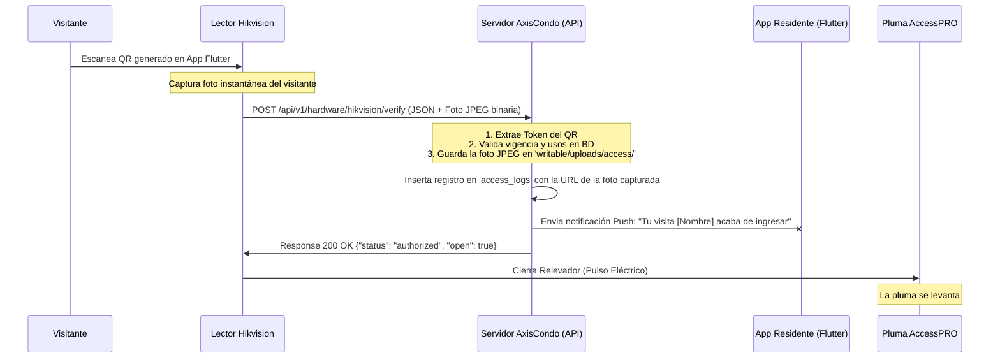

# Propuesta de Integración: Acceso por QR Automático y Captura Fotográfica

Propuesta técnica para la integración del lector facial y de códigos QR **Hikvision DS-K1T670MWX-QR** con las barreras de control de acceso vehicular **AccessPRO** y la plataforma AxisCondo.

---

## 1. Diagrama de Flujo del Sistema



---

## 2. Conexión de Hardware (Física)

La lectora Hikvision cuenta con una salida de relevador para chapa/bloqueo que usaremos como contacto seco para la activación de la pluma AccessPRO.

* **Relevador Hikvision (Control de Acceso):** Bloque de terminales traseras del lector.
  * **Pin NO (Normalmente Abierto)**
  * **Pin COM (Común)**
* **Tarjeta Controladora AccessPRO (Entrada de Pulsador):**
  * Conectar el pin **COM** de Hikvision al pin **GND (Tierra)** de la AccessPRO.
  * Conectar el pin **NO** de Hikvision al pin **BUTTON / OSC / LOOP** de la AccessPRO.
* **Funcionamiento:** Al conceder acceso, el lector cierra el circuito durante 1 segundo, simulando presionar un botón manual, lo cual ordena a la pluma levantarse.

---

## 3. Integración en el Servidor (Controlador Propuesto)

Para automatizar el registro de acceso y de la fotografía tomada por el propio lector, se propone el siguiente endpoint en CodeIgniter 4:

### Nueva Ruta de API (`app/Config/Routes.php`):
```php
$routes->post('api/v1/hardware/hikvision/verify', 'HikvisionApiController::verifyAccess');
```

### Código del Controlador (`app/Controllers/Api/V1/HikvisionApiController.php`):
```php
<?php

namespace App\Controllers\Api\V1;

use App\Controllers\BaseController;
use App\Models\Tenant\QrCodeModel;
use App\Models\Tenant\AccessLogModel;
use CodeIgniter\API\ResponseTrait;

class HikvisionApiController extends BaseController
{
    use ResponseTrait;

    public function verifyAccess()
    {
        // 1. Obtener la cadena del QR y la imagen binaria de la petición multipart/form-data
        $scannedString = $this->request->getPost('qr_data'); // Texto del QR
        $imageFile = $this->request->getFile('picture');      // Foto del rostro tomada por la cámara del lector

        if (empty($scannedString)) {
            return $this->fail('No QR data received', 400);
        }

        // 2. Extraer el token si el QR contiene la URL completa (https://app.axiscondo.mx/qr/token)
        $token = $scannedString;
        if (filter_var($scannedString, FILTER_VALIDATE_URL)) {
            $pathParts = explode('/', parse_url($scannedString, PHP_URL_PATH));
            $token = end($pathParts);
        }

        $qrModel = new QrCodeModel();
        $qr = $qrModel->where('token', $token)->first();

        // 3. Validar existencia y vigencia del QR
        if (!$qr) {
            return $this->respond(['status' => 'denied', 'message' => 'QR no registrado'], 200);
        }

        // Establecer el contexto del condominio para acceder a la base de datos correspondiente
        $condoId = (int)$qr['condominium_id'];
        \App\Services\TenantService::getInstance()->setTenantId($condoId);

        $now = new \DateTime('now', new \DateTimeZone('America/Mexico_City'));
        $validFrom = new \DateTime($qr['valid_from'], new \DateTimeZone('America/Mexico_City'));
        $validUntil = new \DateTime($qr['valid_until'], new \DateTimeZone('America/Mexico_City'));

        if ($qr['status'] !== 'active' || $now < $validFrom || $now > $validUntil) {
            return $this->respond(['status' => 'denied', 'message' => 'QR inactivo o expirado'], 200);
        }

        $limit = (int)($qr['usage_limit'] ?? 1);
        $used = (int)($qr['times_used'] ?? 0);
        if ($limit > 0 && $used >= $limit) {
            return $this->respond(['status' => 'denied', 'message' => 'Pase sin usos disponibles'], 200);
        }

        // 4. Procesar y guardar la fotografía enviada por el lector
        $photoUrl = null;
        if ($imageFile && $imageFile->isValid() && !$imageFile->hasMoved()) {
            $newName = 'hik_auto_' . time() . '_' . $imageFile->getRandomName();
            $imageFile->move(WRITEPATH . 'uploads/access', $newName);
            $photoUrl = 'writable/uploads/access/' . $newName;
        }

        // 5. Registrar el Log de Acceso y quemar un uso del QR
        $logModel = new AccessLogModel();
        $logId = $logModel->insert([
            'type'            => 'entry',
            'recorded_by'     => null, // Registrado de forma desatendida por hardware
            'qr_code_id'      => $qr['id'],
            'unit_id'         => $qr['unit_id'],
            'visitor_name'    => $qr['visitor_name'],
            'visitor_type'    => $qr['visitor_type'] ?? 'pedestrian',
            'visit_type'      => $qr['visit_type'] ?? 'Visita',
            'vehicle_type'    => $qr['vehicle_type'] ?? '',
            'plate_number'    => $qr['vehicle_plate'] ?? '',
            'photo_url'       => $photoUrl, // Foto facial automática
            'photo_plate_url' => null,
            'gate_number'     => 'Pluma Automática',
            'notes'           => 'Ingreso validado y capturado por cámara de lectora Hikvision.',
        ]);

        $qrModel->update($qr['id'], [
            'times_used' => $used + 1,
            'status'     => ($limit > 0 && ($used + 1) >= $limit) ? 'used' : 'active'
        ]);

        // 6. Notificación push inmediata al residente de la unidad (Flutter)
        if ($qr['unit_id']) {
            \App\Services\AccessNotificationService::notifyEntry(
                (int)$qr['unit_id'], $qr['visitor_name'], $condoId, (int)$qr['id']
            );
        }

        // 7. Retornar comando de apertura del relevador
        return $this->respond([
            'status' => 'authorized',
            'open'   => true,
            'message'=> 'Bienvenido ' . $qr['visitor_name']
        ], 200);
    }
}
```

---

## 4. Comparativa de Flujos de Trabajo

| Criterio | Flujo Manual Actual (Guardia) | Nuevo Flujo Propuesto (Automático) |
| :--- | :--- | :--- |
| **Tiempo de procesamiento** | 30 a 60 segundos por visitante. | **2 a 3 segundos en total.** |
| **Fotografía de acceso** | Tomada por el guardia con celular (Identificación / Placas). | Capturada automáticamente por la cámara de la terminal (Rostro). |
| **Apertura de Barrera** | Manual por el guardia (control remoto o botón). | Automática mediante pulso del relevador Hikvision a la AccessPRO. |
| **Notificación al Residente** | Alerta al finalizar el registro en la app. | Alerta instantánea en cuanto el QR se escanea en el lector. |
| **Intervención Humana** | Requerida en todo momento. | **Ninguna (Desatendido).** |
